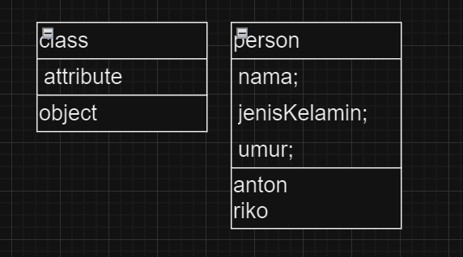
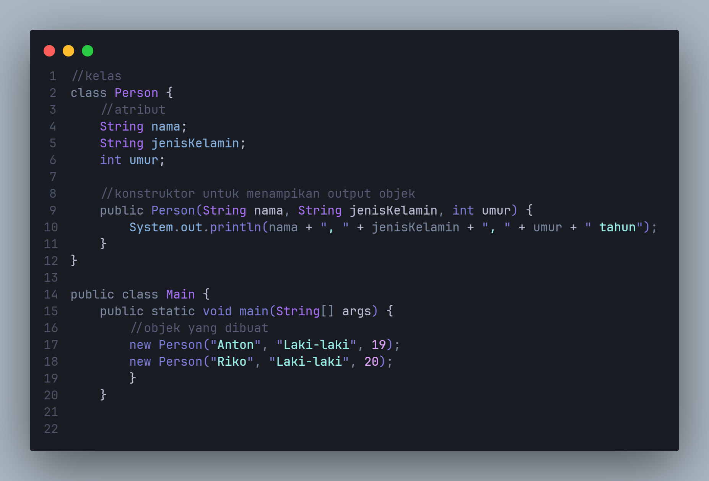
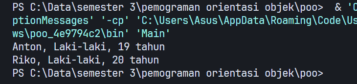
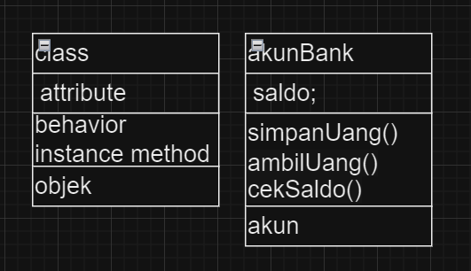
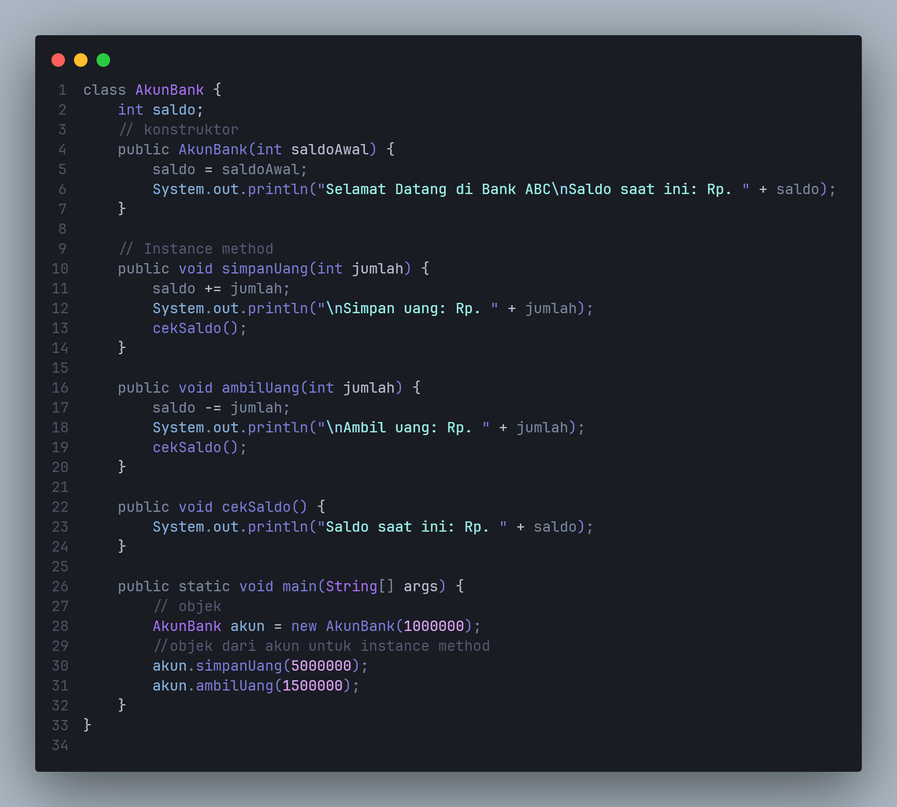
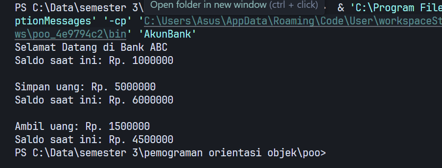

## Zaky Putra Pratama
# class-and-object
### - Apa yang harus didefinisikan sebelum membuat objek? class
### - Buatlah gambar diagram class dan dua buah objek dari class Person bernama anton dan riko

### * program

### * output

### - Buatlah gambar diagram objek AkunBank dengan instance method simpanUang, ambilUang dan cekSaldo

### * program

### * output

